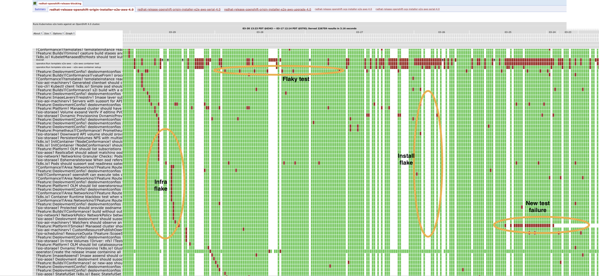

# Failure type classification with the TestGrid data

*Sanket Badhe, Michael Clifford and Marcel Hild*,  *2020-10-27 v0.1.0-dev*

## Overview

In continuous integration (CI) project workflow, developers frequently integrate code into a shared repository. Each integration can then be verified by an automated build and numerous different automated tests. Whenever a failure occurs in a test, developers manually need to analyze failures. Failures in the build can be a legitimate failure or due to some other issues like infrastructure flake, install flake, flaky test, etc. SME can analyze the TestGrid data and determine if failures are legitimate or not. However, it takes a lot of manual effort and reduces the productivity of a team.

In this project, our objective is to automate the failure type classification task with the Testgrid data. As we don’t have labeled data to address this problem, we will focus on unsupervised learning methods and heuristics. Figure 1 shows the TestGrid data with different patterns to analyze the type of failure.

 Figure 1: Different type of failures in TestGrid

 In the following section, we discuss the different patterns in more detail.

* Rows with red interspersed with green: This usually means a flakey test.  Flakey tests pass and fail across multiple runs over a certain period of time. We can trigger this test behavior by using the concept of edge. Edge is the transition of a particular test case from pass to fail on the successive run. We can model edges using a different technique to detect a flakey test.

* Rows with solid red chunks: This behavior is almost always a regression either in the test or the product.  We can analyze each row to check continuous red cells for detecting install flakes.

* Rows with solid red chunks and white to the right: This behavior usually means a new test was added that is failing when running in the release job. For each cell, we will check if there exist all failed test cases to the left and all passing test cases to the right. If there exists this pattern, we will trigger this error.

* Repeating vertical red bars: This behavior usually means the subsystem has a bug, and we will find a set of rows that all fail together on the same runs. For this failure type we can also analyze each column to check for continuous red cells to detect subsystem bugs.

* Failure waterfall:  If there are meandering failures moving from bottom to top, right to the left, this almost always means Infrak flake. We can generate convolutional filters manually to detect Failure waterfall patterns. If it’s hectic to encode all the patterns manually, we can also develop a method to create convolution filters to detect ‘Failure waterfall’ patterns automatically.

If this project is successful, we will develop a tool to automatically analyze the TestGrid data. This tool will perform failure type classification with the Testgrid data to address an existing manual process executed by subject matter experts. Using the tool, the developers can focus on real issues and become more productive. Furthermore, we will provide insights about overall statistics about failures so that test developers can improve on existing test suites.

### A. Problem Statement

Given a TestGrid, we want to classify/detect different failure patterns occurring over a certain period of time. In the later part, we will aggregate the results to conclude about the primary reasons behind failures for each release.

### B. Checklist for project completion

1. A notebooks that shows classification and analysis of different types of test failures on TestGrid data.

2. Jupyterhub image to reproduce the results.

3. Public blog explaining analysis and results.

4. Results hosted for SME to review

### C. Provide a solution in terms of human actions to confirm if the task is within the scope of automation through AI.

Without AI and automation tooling, SME will need to go to TestGrid data of a particular release and look at the failures. An SME will determine if that failure is following any of the patterns that we have discussed in earlier sections. Based on detected patterns, an SME tries to determine the reason behind failure.

### D. Outline a path to operationalization.

Once we have notebooks ready, we will build a Notebook-based Pipeline using Elyra. The results will be stored in S3. We can then use Superset as our dashboard and visualization tool, which SME/developers can access and give feedback. If the tool is deemed useful, we could also look into integrating it with the existing TestGrid project.
